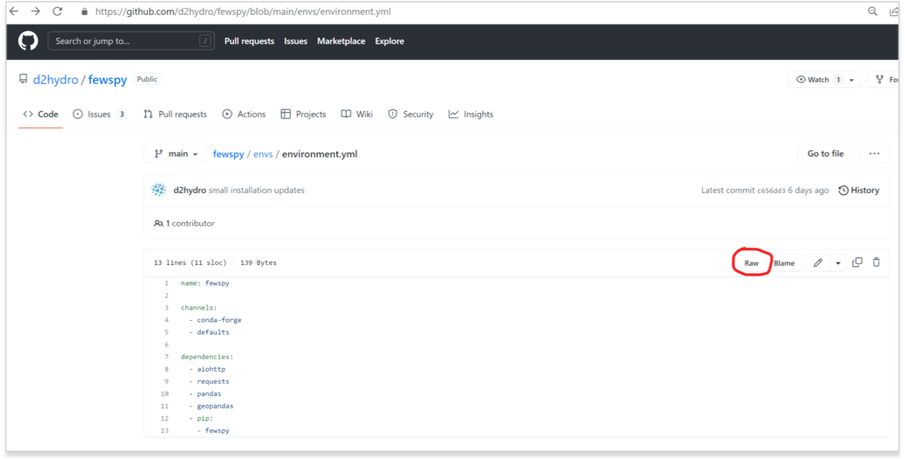
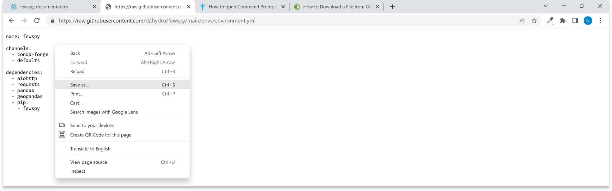
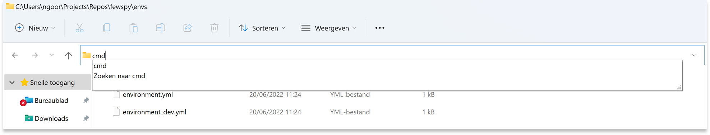
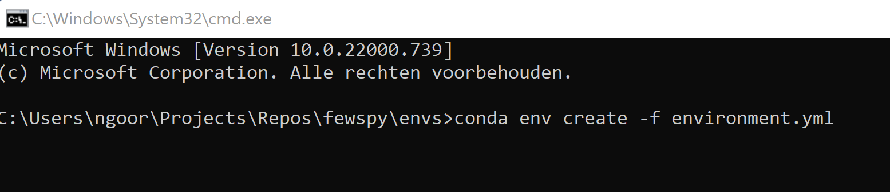
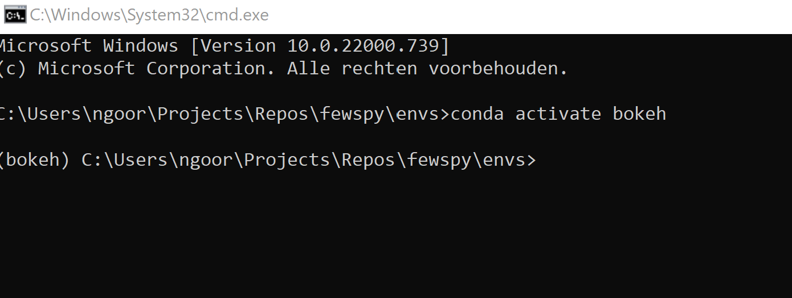

# Fewspy installation tutorial
Fewspy can be installed with pip in any environment with the following Python-packages properly installed: Requests, Aiohttp, Pandas and Geopandas.
If you don’t have such an environment, we recommend going through the following steps:

1. Download anaconda via: [Anaconda](https://www.anaconda.com/)

2. Go to the [environmen.yml](https://github.com/d2hydro/fewspy/blob/main/envs/environment.yml) file and click on ```Raw```, see the red line in the figure below. 


3. Right mouse click and then click on ```Save as``` and choose a map on your computer where you want to save this file. 


4. Via explorer; 
	Go to the map you saved the environment.yml  
	Type ```cmd``` in your address bar and this will open the command prompt, see the example below:    
      

5.	Type in your command prompt: ```conda env create -f environment.yml```, see 
	figure below:


6.	If all the modules are properly installed, your environment is created and 
	you are ready to use Fewspy! You can use Fewspy by activating your environment:
   ```
	conda activate bokeh
    ```


